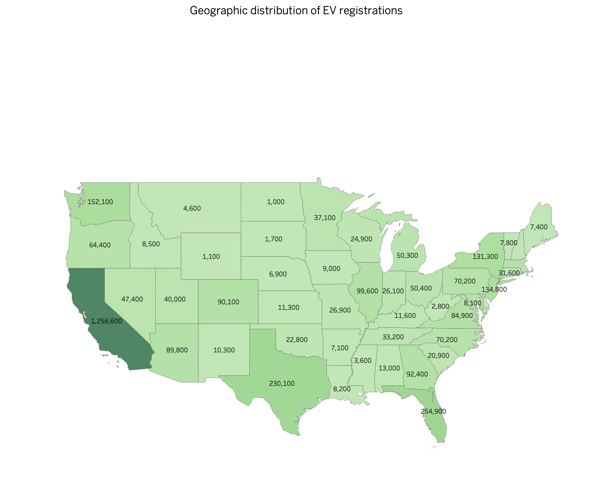
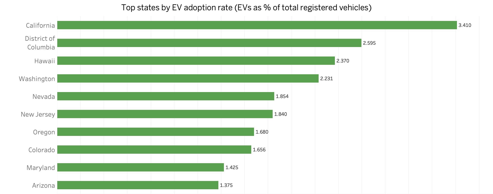
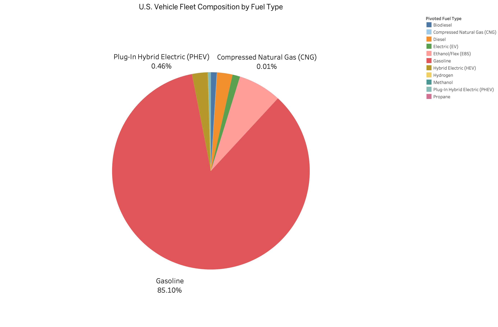
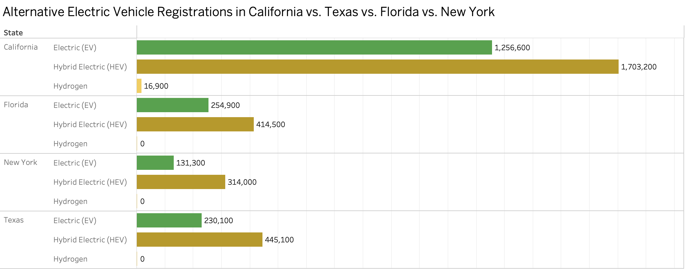

# U.S. Electric Vehicle Market Share Analysis

**Data Analysis Project** | Jupyter Notebook + Tableau Dashboard

## 📋 Project Overview
An intermediate data analysis project examining U.S. EV adoption patterns using state-level vehicle registration data across all 50 states and D.C.

**Key deliverables:**
- Cleaned and analyzed EV, PHEV, HEV, and gasoline market shares
- Identified top/bottom adopting states and compared California vs. other large states
- Built interactive Tableau dashboard + presentation slides
- Provided data-driven recommendations for EV infrastructure investment  
  **Key finding** — California leads at 3.41% EV adoption, while bottom states sit below 0.2% — a 20x gap.

## 🛠️ Tech Stack
- **Python**: Jupyter Notebook in VS Code (pandas for cleaning & calculations)
- **Visualization**: Tableau (map, bars, pie chart)
- **Presentation**: PowerPoint + Tableau Workbook
- **Written Report**: Notion (full notes) + PDF

## 📁 Project Structure
- `notebooks/` → Main Jupyter Notebook
- `data/` → Raw & cleaned datasets
- `reports/` → Final PDF report
- `presentations/` → Tableau Workbook
- `images/` → Dashboard screenshots

## 📊 Dashboard Previews

## 📊 Interactive Tableau Workbook
[👉 Open full interactive Tableau workbook (.twbx)](presentations/U.S._EV_Market_Share_Presentation.twbx)

## 📝 Full Written Report (Notion)
[👉 View on Notion](https://mahabala.notion.site/U-S-Electric-Vehicle-Market-Share-Analysis-Findings-Report-335e583fcafd8145b429eea97e5f18f4)

## 📄 Downloadable PDF Report
[👉 Download Full Report](reports/U.S.%20Electric%20Vehicle%20Market.pdf)

## 🚀 How to Run
1. Clone the repo: `git clone https://github.com/aimsha2319/Analyzing-U.S.-Electric-Vehicle-Market-Share.git`
2. Open the notebook in VS Code or Jupyter
3. Install packages: `pip install -r requirements.txt`

## 📌 Topics
data-analysis, python, jupyter-notebook, tableau, electric-vehicles, ev-adoption, market-share, pandas, powerpoint

---

*Built as part of a data analytics portfolio project — April 2026*
